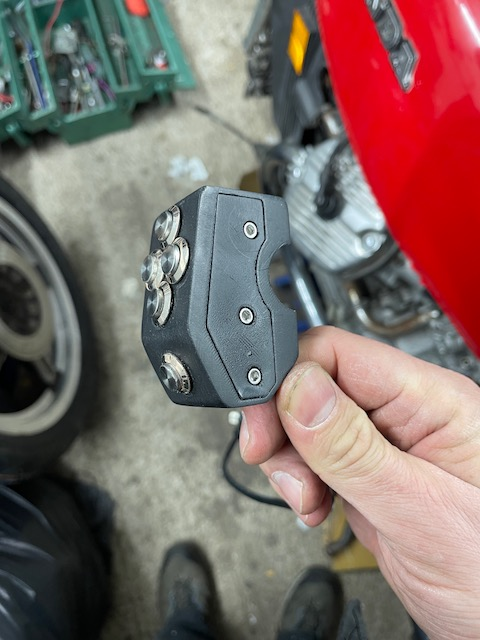
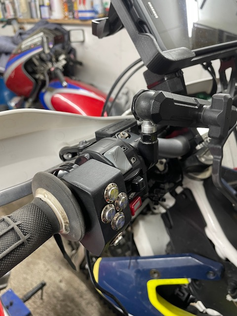
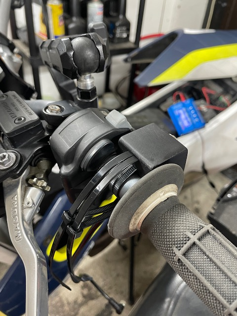
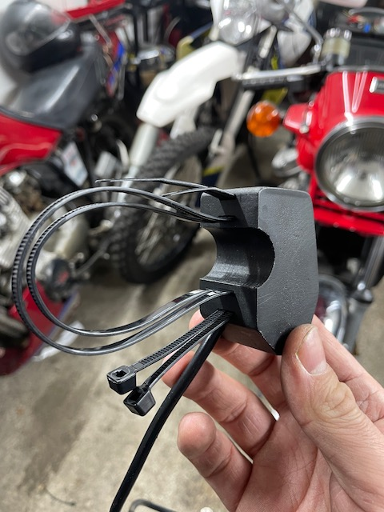

# Nav-Controller

## Project Description
The Open-Navigation-Controller is a Bluetooth module for a custom navigation controller. This project includes a 3D-printable enclosure designed to house five push buttons (Left, Right, Up, Down, and Select). The buttons are directly screwed in with a 12mm thread, making assembly easy and secure.

**Note:** The STL printable file includes only the enclosure for the buttons, not the controller itself.
The code currently includes the default commands for left, right, up, down, zoom, and orientation for OsmAnd+. These commands can be adjusted in the `main.cpp` file. For more details, see [OsmAnd+ External Input Devices](https://osmand.net/docs/user/map/interact-with-map/#external-input-devices).

### Keyboard Map

|             | Click       | Longpress  | DoubleClick |
|-------------|-------------|------------|-------------|
| **Button 1**| Arrow Up    |            | Arrow Up    |
| **Button 2**| Arrow Right | +          | Arrow Right |
| **Button 3**| C (center)  |            | D (direction)|
| **Button 4**| Arrow Left  | -          | Arrow Left  |
| **Button 5**| Arrow Down  |            | Arrow Down  |

### Features
- **Enclosure**: Two-piece, 3D-printable enclosure.
- **Buttons**: Five push buttons for navigation and selection.
- **Mounting**: Fits 22mm motorcycle handlebars for easy mounting.
- **Applications**: Ideal for navigation setups with OsmAnd+ / Roadbook navigation, custom navigation devices, gaming controllers, or DIY interfaces.
- **Material**: Printed example in PETG, 0.1mm resolution.

### Requirements
- **Hardware**: ESP32-C3-DevKitM-1
- **Software**: Arduino Framework, PlatformIO

### STL File
You can view the STL file for the enclosure directly on GitHub:
[Enclosure STL File](print/navController_case.stl)

### Libraries Used
- [OneButton](https://github.com/mathertel/OneButton) by Matthias Hertel
- [ESP32 BLE Keyboard](https://github.com/T-vK/ESP32-BLE-Keyboard) by T-vK

### Installation
1. Clone the repository:
    ```sh
    git clone https://github.com/username/Open-Navigation-Controller.git
    cd Open-Navigation-Controller
    ```
2. Install the dependencies:
    ```sh
    pio lib install
    ```
3. Compile and upload the code to the ESP32-C3-DevKitM-1:
    ```sh
    pio run --target upload
    ```

### Usage
1. Turn on the controller.
2. Connect to the device via Bluetooth.
3. Use the buttons for navigation and selection.

### Images
<table>
  <tr>
    <td></td>
    <td></td>
  </tr>
  <tr>
    <td></td>
    <td></td>
  </tr>
</table>

### License
This project is licensed under the MIT License. See the LICENSE file for more details.


